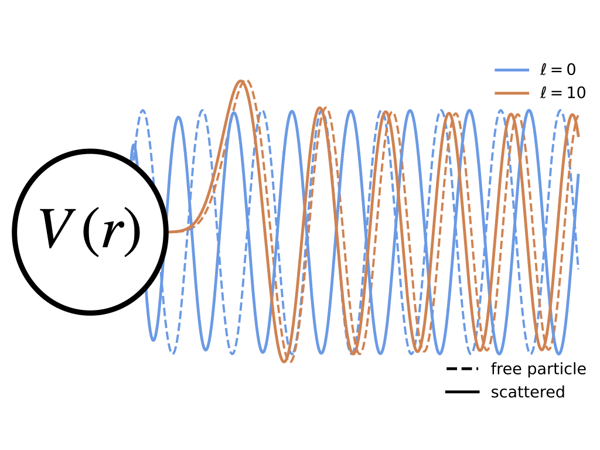

# pykawa

  

Exact solutions for the phase shifts and scattering cross sections for Yukawa potentials. See the notebooks for example usage. 

Solutions are obtained following the variable phase method. The mathematica scripts used to compute the cross sections can be found in the "mathematica_scripts" directory. 

## Features

- Load precomputed solutions for the scattering cross section, including the angle-dependent, total, momentum, and viscosity cross sections, for Yukawa potentials in the Born and semi-classical regime. Solutions include both repulsive and attractive (resonant) cross sections
- Use interpolators to obtain solutions across a range of parameter space
- Compute thermally averaged cross sections relevant for structure formation

## Author

pykawa was created in 2026 by Daniel Gilman.

Built with [Cookiecutter](https://github.com/cookiecutter/cookiecutter) and the [audreyfeldroy/cookiecutter-pypackage](https://github.com/audreyfeldroy/cookiecutter-pypackage) project template.
